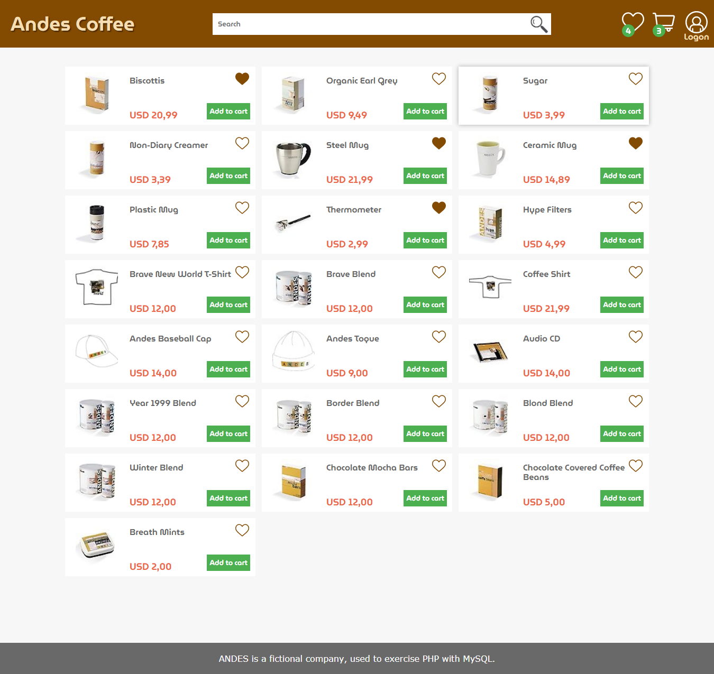
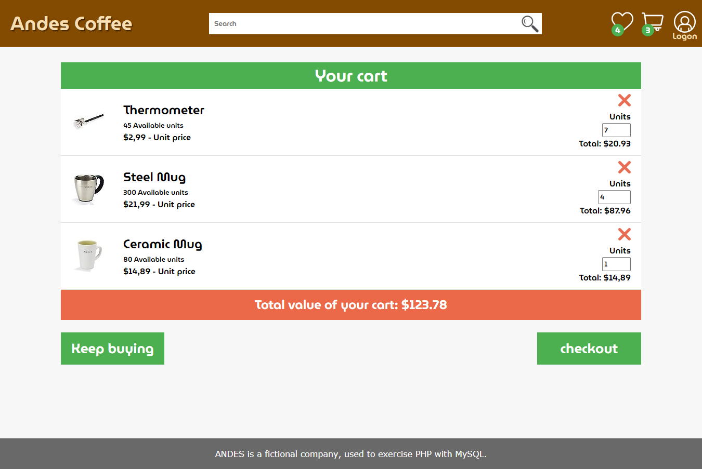
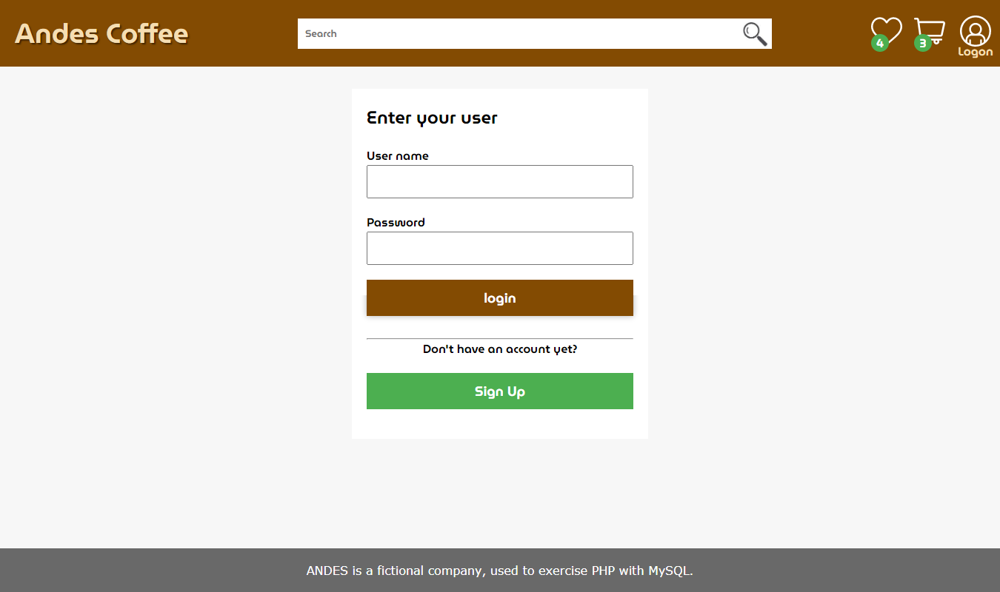
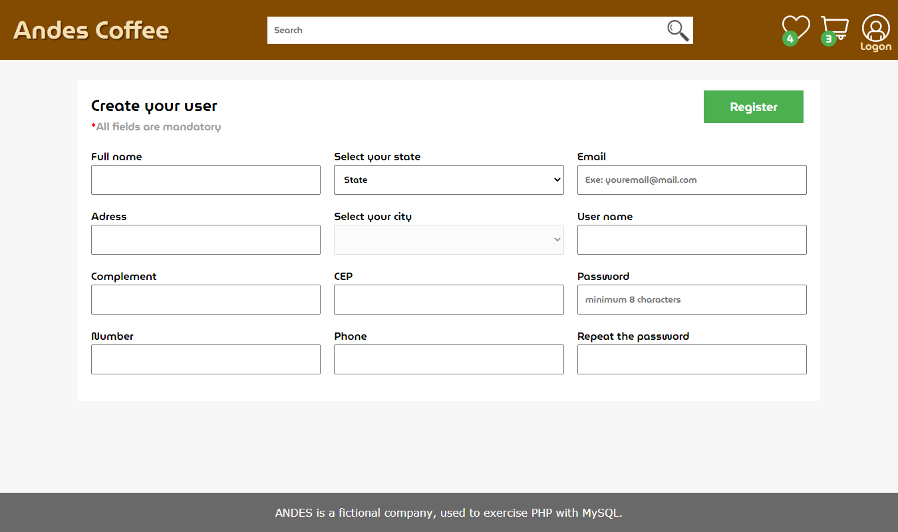
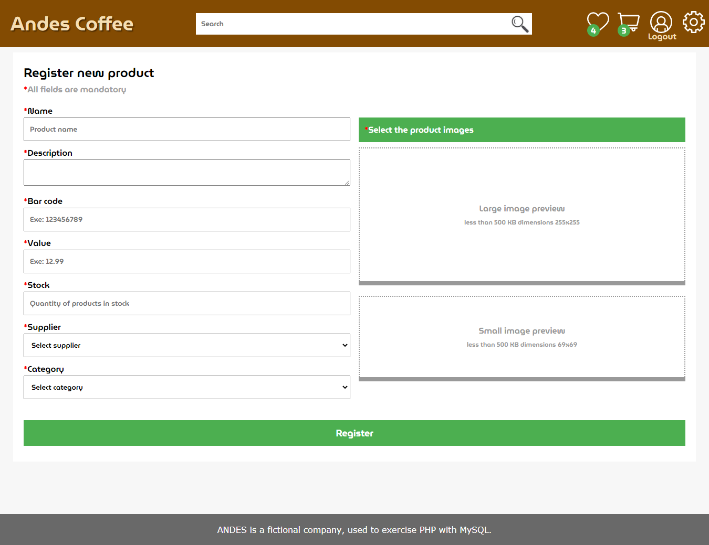
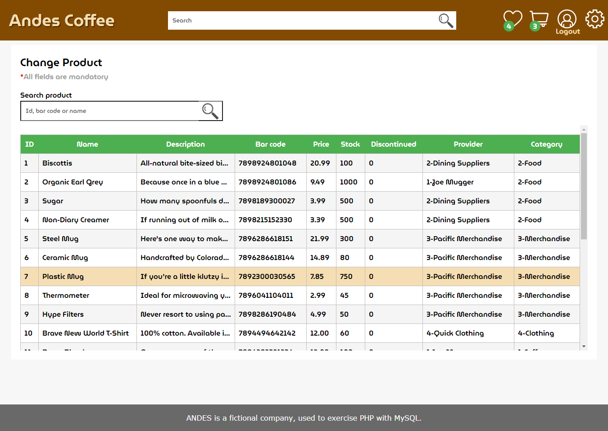
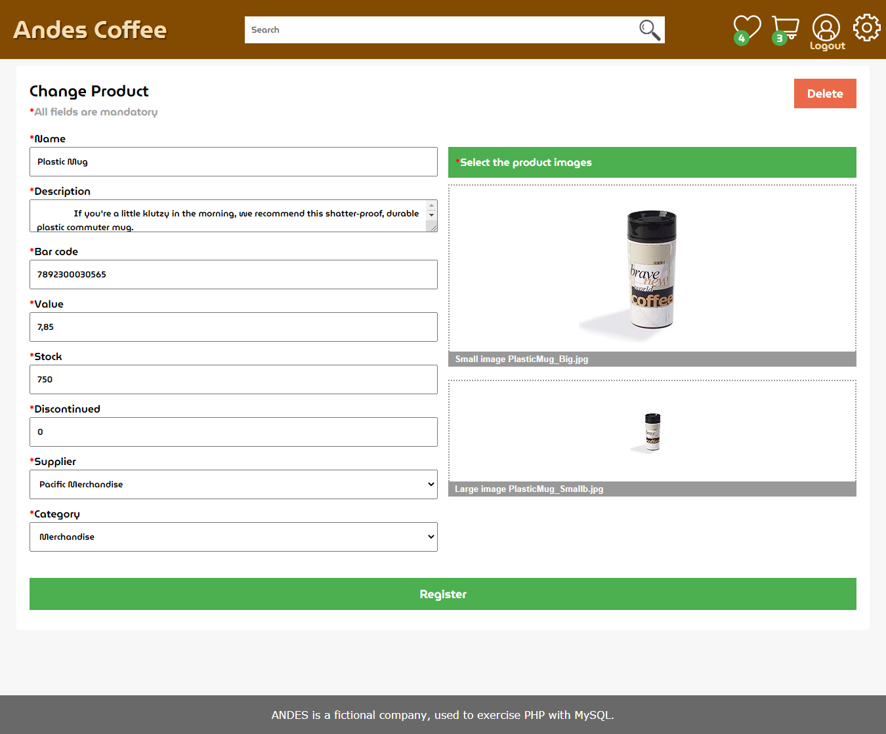

# Andes Coffee
Andes Coffee is a fictional store focused on selling products related to cafeteria, created to exercise knowledge about the technologies used in this project focusing mainly on the back end.

  
  
  
  
  
  
  

## Functionalities
#### Home page
- List of products.
- Product search.
- Add or remove products to favorites.
- Filtering favorites.
- Add products to the cart.
#### Cart page
- Remove products from the cart and make it possible to change the quantity of each product by adding the value on the desired quantity adding the total value of the products.
#### Details page
- Present a more detailed view of the product and add it to the cart.
#### Login page
- Enables an already registered user to connect with the store, if the user is an administrator, the registration and product change functionality will be available.
#### User registration page
- A new user can be registered by filling out the required requirements.
- Username and password validation, an existing username will not be accepted and the password must be greater than or equal to eight digits.
#### Admin page
- Registration of a new product making it possible to upload images of it.
- Alteration of products makes it possible to search for the desired product by id, barcode or description, lists all products where all information of the selected product, including images, can be altered.
#### Payment page
- Front end only, credit card and boleto.

## Technologies
Developed with the following technologies:

- [PHP7](https://www.php.net/manual/pt_BR/intro-whatis.php)
- [MySql](https://www.mysql.com/)
- [XAMPP](https://www.apachefriends.org/pt_br/index.html)
- [jQuery](https://jquery.com/)

### Others

- Use of the IBGE API to insert search by states and municipalities.

#### License
- free for study projects.